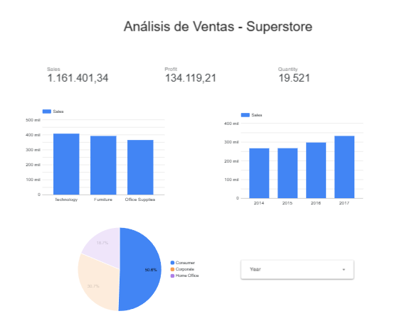

# 📊 Análisis de Ventas Retail - Superstore Dashboard

## Descripción

Dashboard interactivo desarrollado en Power BI para el análisis de ventas de una cadena retail en Estados Unidos. El proyecto incluye limpieza y transformación de datos con Python, y visualización de KPIs clave para la toma de decisiones empresariales.

## 🎯 Objetivos

- Analizar tendencias de ventas y ganancias a lo largo del tiempo
- Identificar productos y categorías con mejor rendimiento
- Evaluar el desempeño por región geográfica
- Detectar patrones estacionales en las ventas

## 📈 Insights Principales

- **Tecnología** es la categoría con mayor margen de ganancia (17.4%), mientras que **Furniture** tiene el menor (2.5%)
- Las ventas muestran un patrón estacional con picos en **noviembre y diciembre** (temporada navideña)
- La región **West** lidera en ventas totales, pero **East** tiene mejor margen de ganancia
- El segmento **Consumer** representa el 51% de las ventas totales
- Los descuentos mayores al 20% generan pérdidas en la mayoría de subcategorías

## 🛠️ Tecnologías Utilizadas

| Herramienta | Uso |
|-------------|-----|
| Python | Limpieza y transformación de datos |
| Pandas | Manipulación de DataFrames |
| Power BI | Visualización y dashboard interactivo |
| DAX | Medidas calculadas y KPIs |

## 📁 Estructura del Proyecto

```
superstore-sales-analysis/
├── README.md
├── data/
│   ├── Sample - Superstore.csv    # Dataset original
│   └── superstore_clean.csv       # Dataset procesado
├── notebooks/
│   └── 01_limpieza_datos.ipynb    # Notebook de limpieza
├── dashboard/
│   ├── superstore_dashboard.pbix  # Archivo Power BI
│   └── medidas_dax.md             # Documentación de medidas
└── images/
    └── dashboard_preview.png      # Captura del dashboard
```

## 📊 Dataset

- **Fuente:** [Kaggle - Superstore Dataset](https://www.kaggle.com/datasets/vivek468/superstore-dataset-final)
- **Registros:** 9,994 transacciones
- **Período:** 2014 - 2017
- **Variables:** 21 columnas (ventas, ganancias, categorías, regiones, etc.)

## 🚀 Cómo Ejecutar

### 1. Clonar el repositorio
```bash
git clone https://github.com/tu-usuario/superstore-sales-analysis.git
cd superstore-sales-analysis
```

### 2. Instalar dependencias
```bash
pip install pandas jupyter
```

### 3. Ejecutar notebook de limpieza
```bash
jupyter notebook notebooks/01_limpieza_datos.ipynb
```

### 4. Abrir dashboard
Abrir el archivo `dashboard/superstore_dashboard.pbix` en Power BI Desktop.

## 📸 Preview del Dashboard



## 📝 Medidas DAX Principales

```dax
Total Ventas = SUM(superstore[Sales])

Total Ganancias = SUM(superstore[Profit])

Margen (%) = DIVIDE([Total Ganancias], [Total Ventas], 0) * 100

Total Órdenes = DISTINCTCOUNT(superstore[Order ID])

Ticket Promedio = DIVIDE([Total Ventas], [Total Órdenes], 0)
```

## 👤 Autor

**Martin Alonso Centeno Leon**
- LinkedIn: [linkedin/martin](https://www.linkedin.com/in/martin-alonso-centeno-leon-220586342/)
- GitHub: [github/martin0161](https://github.com/martine0161)

## 📄 Licencia

Este proyecto es de uso educativo y personal.
